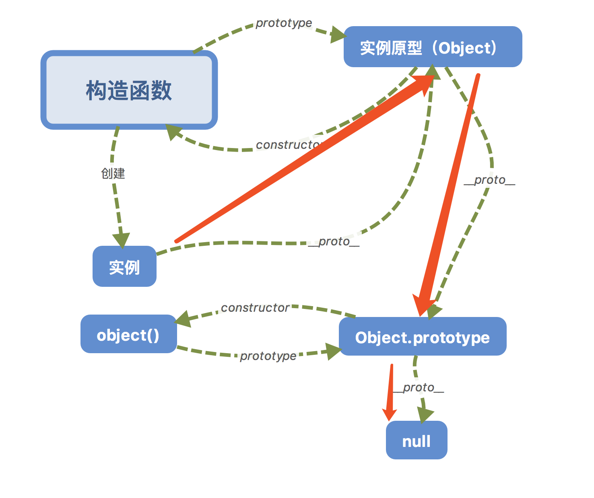

# JS 相关

## 解释一下什么是原型链


**每个函数都有一个 prototype 属性（函数才拥有的属性）**，函数的 prototype 属性指向了一个对象，这个对象正是调用该构造函数而创建的实例的原型。

那什么是原型呢？**每一个 JavaScript 对象(null 除外)在创建的时候就会与之关联另一个对象，这个对象就是我们所说的原型**，每一个对象都会从原型"继承"属性。

**每一个 JavaScript 对象(除了 null )都具有的一个属性，叫**proto\*\*\*\*，这个属性会指向该对象的原型。

```
function Person() {}  // 构造函数
var person = new Person();  // 实例
console.log(person.__proto__ === Person.prototype); // true
```

构造函数的 prototype 以及实例的**proto**都指向实例的原型。

每个原型都有一个 constructor 属性指向关联的构造函数。

```
function Person() {}
console.log(Person === Person.prototype.constructor); // true
```

原型也是一个对象，也有自己的**proto**属性，指向原型。

当读取实例的属性时，如果找不到，就会查找与对象关联的原型中的属性，如果还查不到，就去找原型的原型，一直找到最顶层为止(null)。



参考：[JavaScript 深入之从原型到原型链](https://github.com/mqyqingfeng/Blog/issues/2)

## 手写实现 new

#### 一句介绍 new

> new 运算符创建一个用户定义的对象类型的实例或具有构造函数的内置对象类型之一

#### new 都做了些什么？

- 创建了一个新的实例对象
- 该对象的**proto**属性与构造函数的 prototype 全等
- 改变 this 指向，使其指向新创建的实例对象
- 返回该中间对象,也就是返回了实例对象

也就是说，通过 new 操作符实现的实例对象，即可访问构造函数的属性，也可以访问构造函数原型上的属性。

#### 手写一个 new

```
function _new() {
    var obj = new Object(),  // 创建一个新的对象，并返回
    Constructor = [].shift.call(arguments); // 截取传入函数的第一个参数
    obj.__proto__ = Constructor.prototype; // 将第一个参数的prototype与要返回的对象建立关联
    var result = Constructor.apply(obj, arguments);  // 使用apply，改变构造函数的this指向，使其指向新对象，这样，obj就可以访问到构造函数中的属性了
    return typeof result === 'object' ? result : obj;  // 如果函数返回值是一个对象，那就返回这个对象，如果不是就返回新的对象

};

```

## call 、apply 、 bind

共同点：

- 都是改变 this 指向的
- 三者的第一个参数都是 this 指向的对象

区别：语法不同

### call

```
fun.call(thisArg, arg1, arg2, ...)
```

- 调用 `call` 的对象，必须是个函数 `Function`
- 第一个参数：`thisArg` 是 `this` 的指向，如果不传默认为全局对象 `window`
- 第二个参数开始，可以接受任意参数，会映射到相应位置的 `Function` 的参数上面

### apply

```
fun.apply(thisArg, [argsArray])
```

- 调用 apply 的对象，必须是个函数 `Functin`
- 第一个参数：`thisArg` 是 `this` 的指向，如果不传默认为全局对象 `window` 。和 `call` 一致。
- 第二个参数：**必须是数组或者类数组，它们会被转成类数组**，传到调用的函数中，并且映射到 function 对应的参数上。call 和 apply 之间很重要的一个区别

### bind

```
fun.bind(thisArg[, arg1[, arg2[, ...]]])
```

- `bind` 方法的返回值是函数，并且需要调用后，才会执行。而 `apply` 和 `call` 是立即调用的

#### this 的指向

this 永远指向最后调用它的那个对象

#### 怎么解决由于 this 指向产生的问题

- 使用 ES6 的箭头函数
- 在函数内部使用 \_this = this
- 使用 apply、call、bind （改变 this 指向）
- new 实例化一个对象 （改变 this 指向）

## 作用域与作用域链 -- TODO

## 闭包

闭包就是能够读取其他函数内部变量的函数。

由于在 Javascript 语言中，只有函数内部的子函数才能读取局部变量，因此可以把闭包简单理解成"定义在一个函数内部的函数"。

eg.

```
function init() {
    var name = "Mozilla"; // name 是一个被 init 创建的局部变量
    function displayName() { // displayName() 是内部函数，一个闭包
        alert(name); // 使用了父函数中声明的变量
    }
    displayName();
}
init();
```

#### 闭包的用途

- 可以读取函数内部的变量
- 让这些变量的值始终保持在内存中

#### 闭包的注意事项

- 由于闭包会使得函数中的变量都被保存在内存中，内存消耗很大，所以不能滥用闭包，否则会造成网页的性能问题，在 IE 中可能导致内存泄露。解决方法是，在退出函数之前，将不使用的局部变量全部删除；
- 闭包会在父函数外部，改变父函数内部变量的值。所以，如果你把父函数当作对象（object）使用，把闭包当作它的公用方法（Public Method），把内部变量当作它的私有属性（private value），这时一定要小心，不要随便改变父函数内部变量的值。

#### 实际使用场景

定义公共函数，并令其可以访问私有函数和变量。

```
var Counter = (function() {
  var privateCounter = 0;
  function changeBy(val) {
    privateCounter += val;
  }
  return {
    increment: function() {
      changeBy(1);
    },
    decrement: function() {
      changeBy(-1);
    },
    value: function() {
      return privateCounter;
    }
  }
})();

console.log(Counter.value()); /* logs 0 */
Counter.increment();
Counter.increment();
console.log(Counter.value()); /* logs 2 */
Counter.decrement();
console.log(Counter.value()); /* logs 1 */
// 该共享环境创建于一个立即执行的匿名函数体内。这个环境中包含两个私有项：名为 privateCounter 的变量和名为 changeBy 的函数。
// 这两项都无法在这个匿名函数外部直接访问。必须通过匿名函数返回的三个公共函数访问。

// 这三个公共函数(Counter.increment，Counter.decrement 和 Counter.value)是共享同一个环境的闭包。
// 多亏 JavaScript 的词法作用域，它们都可以访问 privateCounter 变量和 changeBy 函数。
```
